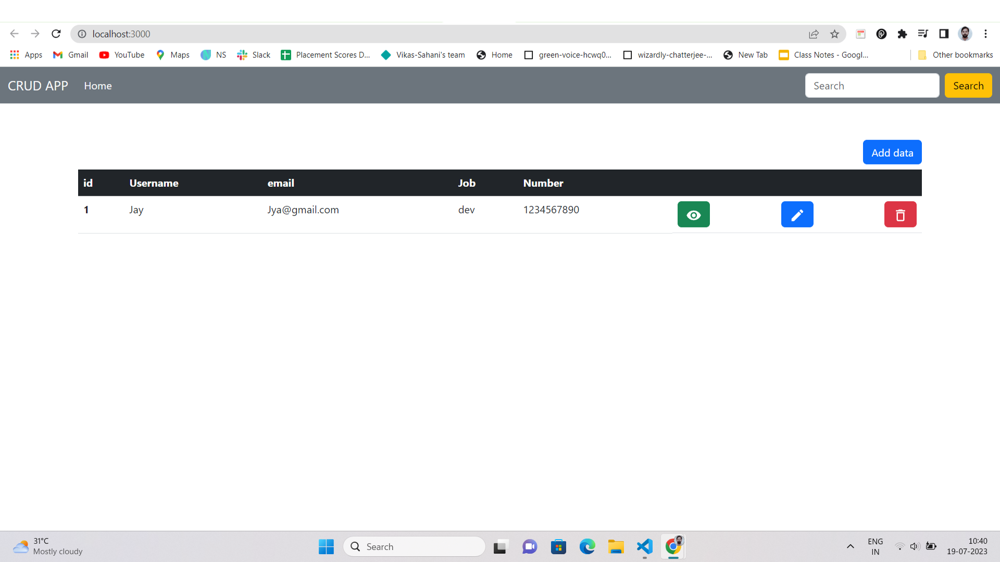
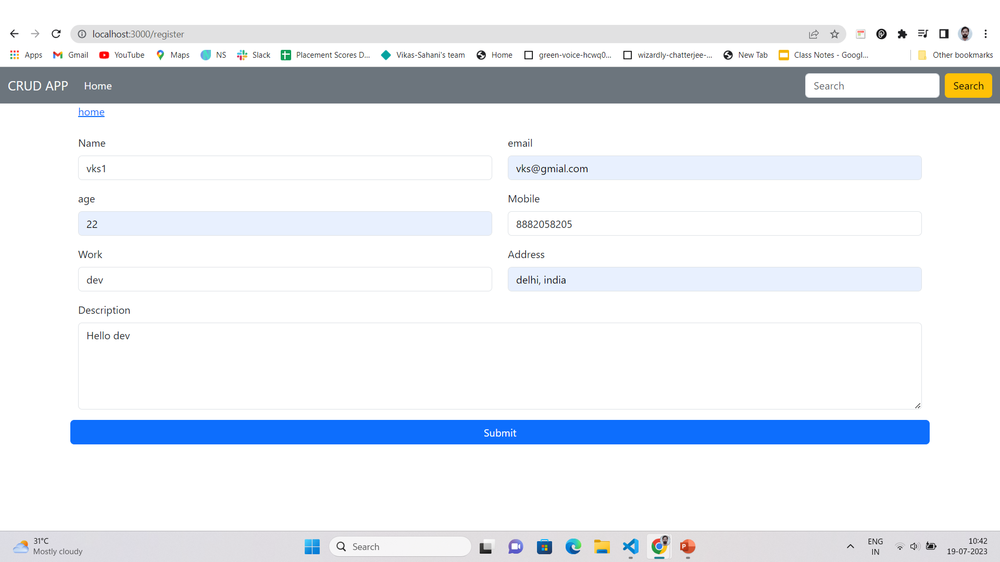
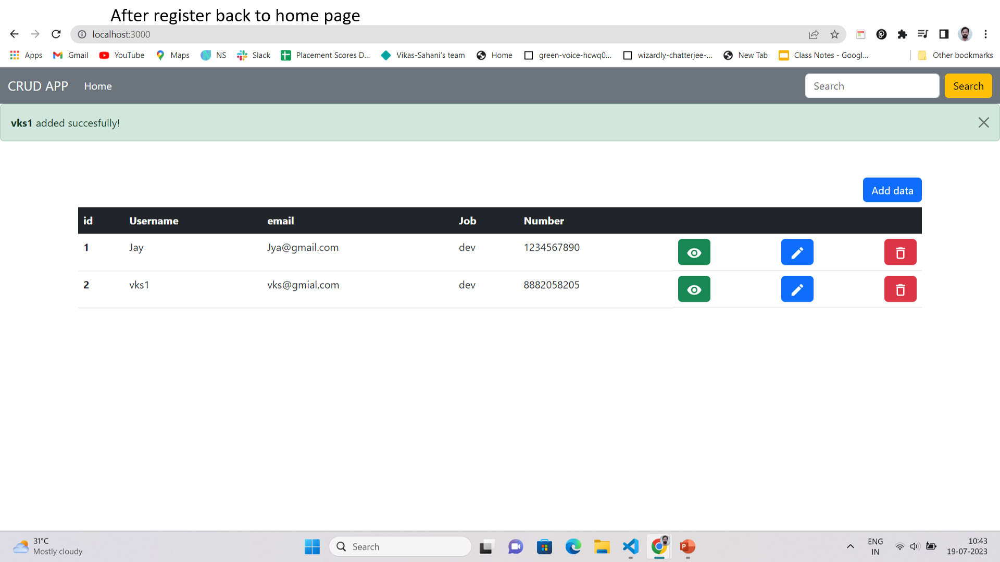
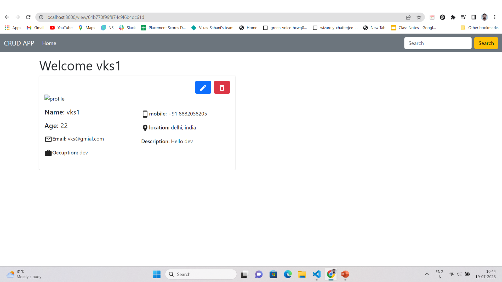
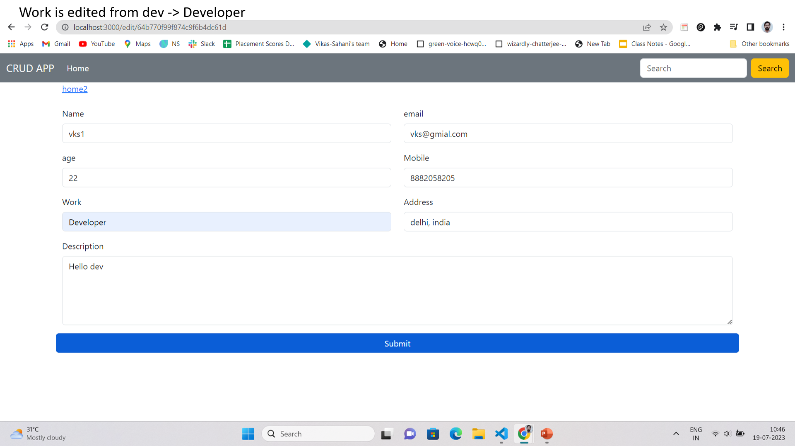
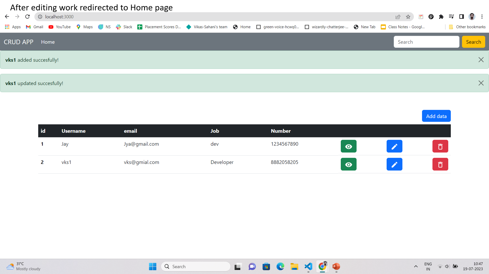
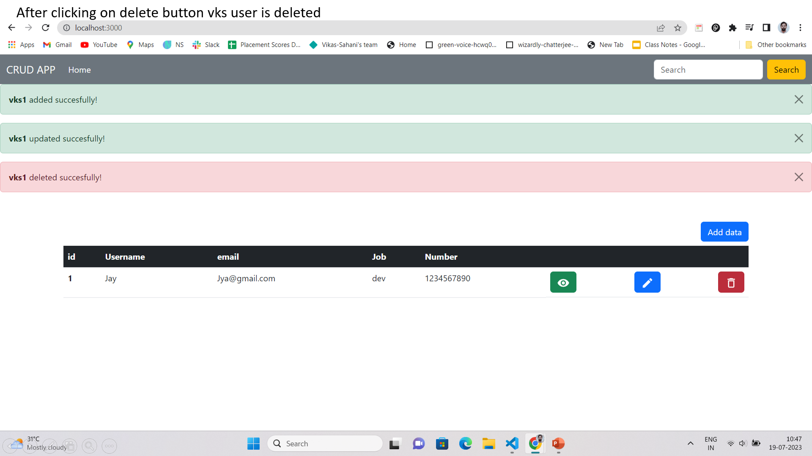

if someone using this project first time & want to run in your local system then please follow the following stpes:-

1. please install all the dependency of client & server folder using `npm i` by going in these directory
2. after installing dependencies of client folder & server folder pleas run the

- client using `npm start ` command &
- in server folder `nodemon app.js` or `node app.js` (recommended to use `nodemon app.js` so that don't need to each run the server)

3. make sure you also add the .env file in your server folder & inside this .env file you need `PORT=xyz` & `DATABASE="xyz"` (please replace the xyz here according to your port number & database)

If you are not able to run this you can contact me on this email(vikassahani1110@gmail.com)

currently I am facing an issue with deploying the backend so I am pasting the UI screenshots so that It's clear that how UI looks.

- later I'll also add here Deployed link.

# Home page

# Register page

# View Page

# Update Page

# Delete Page

